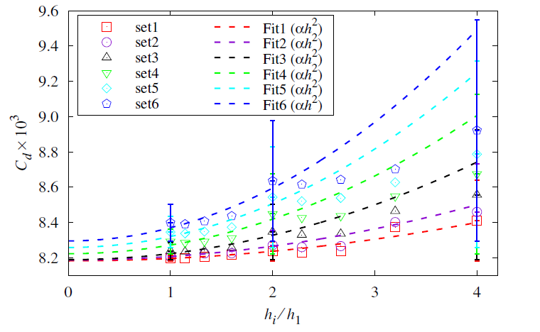

# 📘 Estimate the Numerical Uncertainty for CFD Simulation

This repository provides MATLAB code and published research for estimating the **numerical uncertainty** in **Computational Fluid Dynamics (CFD)** simulations. The methodology is based on **grid convergence studies** and follows recognized standards such as the **Grid Convergence Index (GCI)** and **Richardson Extrapolation**.

---

## 📄 1. What's Included

- ✅ MATLAB source code for uncertainty quantification
- ✅ Published paper (PDF) describing the methodology
- ✅ Example data and instructions for reproduction

---

## 📊 2. Key Features

- ✨ Automates uncertainty estimation using:
  - Grid Convergence Index (GCI)
  - Richardson Extrapolation
- 📈 Supports both scalar outputs and spatial distributions
- 📁 Handles multiple mesh levels (coarse, medium, fine)
- 📎 Includes a real-world CFD application example

---


## 3. Example of uncertainty results

- Convergence of the drag coefficient for flow around NACA0012 at angle of attack of $0^◦$ with SA



<!-- 


- Contour of curl in various Re = 50, 100 and 150.
 
-->
## 4. Reference
- [1] P. J. Roache. Verification and validation in computational science and engineering. Hermosa Albuquerque, NM, 895, 1998.

- [2] I.B. Celik, U. Ghia, P.J. Roache, C.J. Freitas, H. Coleman, P.E. Raad, I. Celik, C. Freitas, H.P. Coleman. Procedure for estimation and reporting of uncertainty due to discretization in CFD applications. Journal of Fluids Engineering, 130(7):078001, 2008.

- [3] R. Cosner, B. Oberkampf, C. Rumsey, C. Rahaim, T. Shih. AIAA Committee on standards for computational fluid dynamics: status and plans. In 44th AIAA Aerospace Sciences Meeting and Exhibit, 889, 2006.

- [4] T. Xing, F. Stern. Factors of safety for Richardson extrapolation. Journal of Fluids Engineering, 132(6), 2010.

- [5] L. Eça, M. Hoekstra. An uncertainty estimation exercise with the finite-difference and finite-volume versions of parnassos. In Workshop on CFD Uncertainty Analysis, 6, 2004.

- [6] L. Eça, M. Hoekstra. On the influence of the iterative error in the numerical uncertainty of ship viscous flow calculations. In 26th Symposium on Naval Hydrodynamics, 17–22, 2006.

- [7] L. Eça, G.N.V.B. Vaz, M. Hoekstra. A verification and validation exercise for the flow over a backward facing step. Proceedings of the ECCOMAS CFD, 2010.

- [8] L.F. Richardson. IX. The approximate arithmetical solution by finite differences of physical problems involving differential equations, with an application to the stresses in a masonry dam. Philosophical Transactions of the Royal Society of London. Series A, Containing Papers of a Mathematical or Physical Character, 210(459-470):307–357, 1911.


## 5. Publication and Citation


## 5.1 📄 Publication

Followings are our publications:

- **S. Jin**, R. Zha, H. Peng and W. Qiu, (2021). Uncertainty analysis for CFD simulations of flow over flat plate and foil with OpenFOAM. In Proceedings of the 29th Annual Conference of the Computational Fluid Dynamics Society of Canada. [PDF](CFD2020-Extended-Abstract-of-Uncertainty-Revised-V2.0/CFDSC2020-full-paper-template-LaTex.pdf)


### 5.2 📚 Citation (BibTeX)


```bibtex
@inproceedings{jin2021uncertainty,
  author    = {Jin, Shanqin and Zha, Rui and Peng, Haipeng and Qiu, Wei},
  title     = {Uncertainty analysis for CFD simulations of flow over flat plate and foil with OpenFOAM},
  booktitle = {Proceedings of the 29th Annual Conference of the Computational Fluid Dynamics Society of Canada},
  year      = {2021}
}

```
